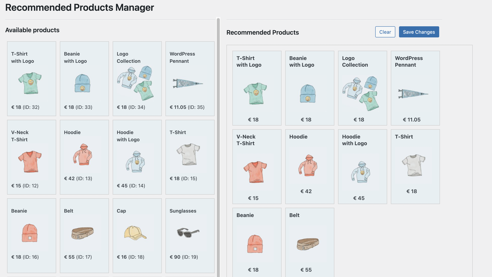

## Usage

<h1>Recommended Products Manager Plugin for WooCommerce</h1>

After the plugin activation, in the Wordpress Dashboard go to Recommended Products on the sidebar.

Drag and drop the items from the Available Products box into the Recommended Products box and click on the Save button, otherwise Clear.

Then open any post or page and use the following shortcode:

```bash
[recommended]
```

## Admin



## Front End

<br>
